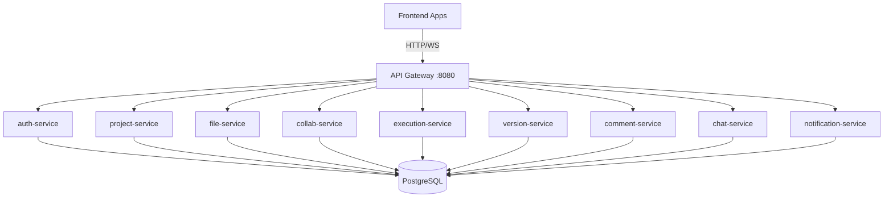
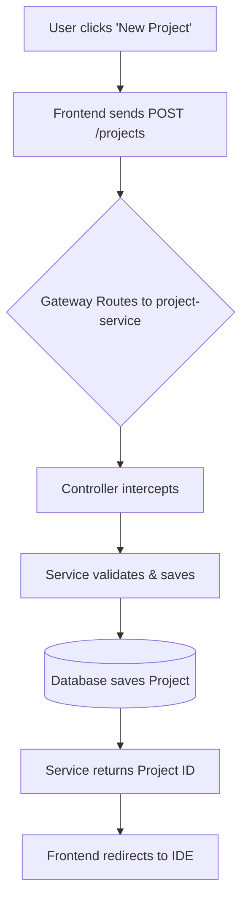
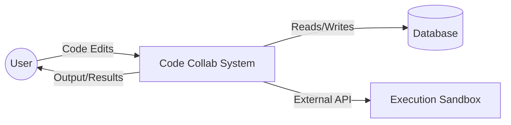
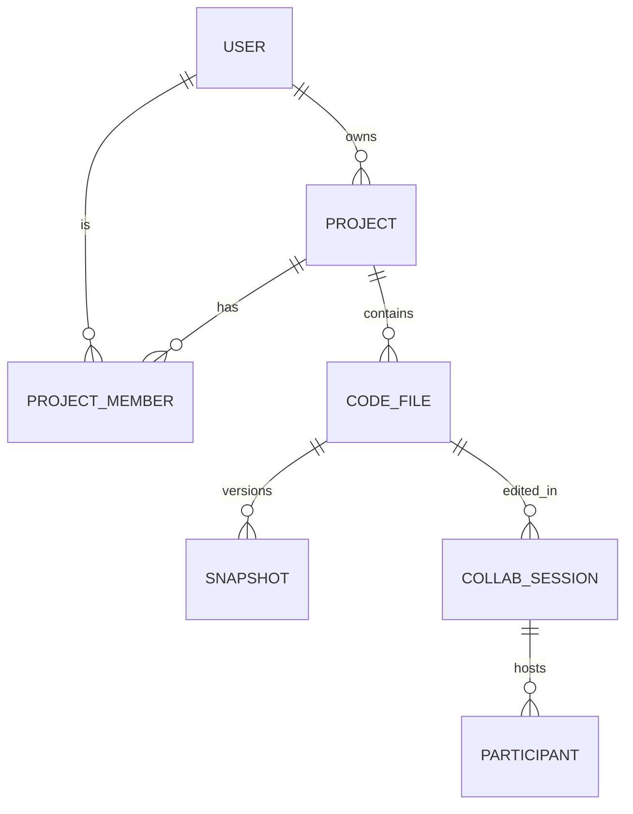
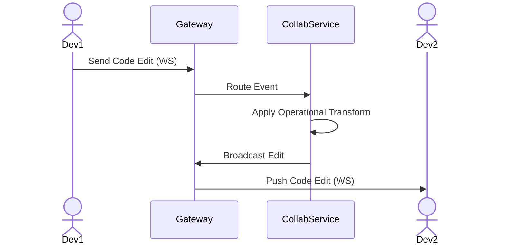
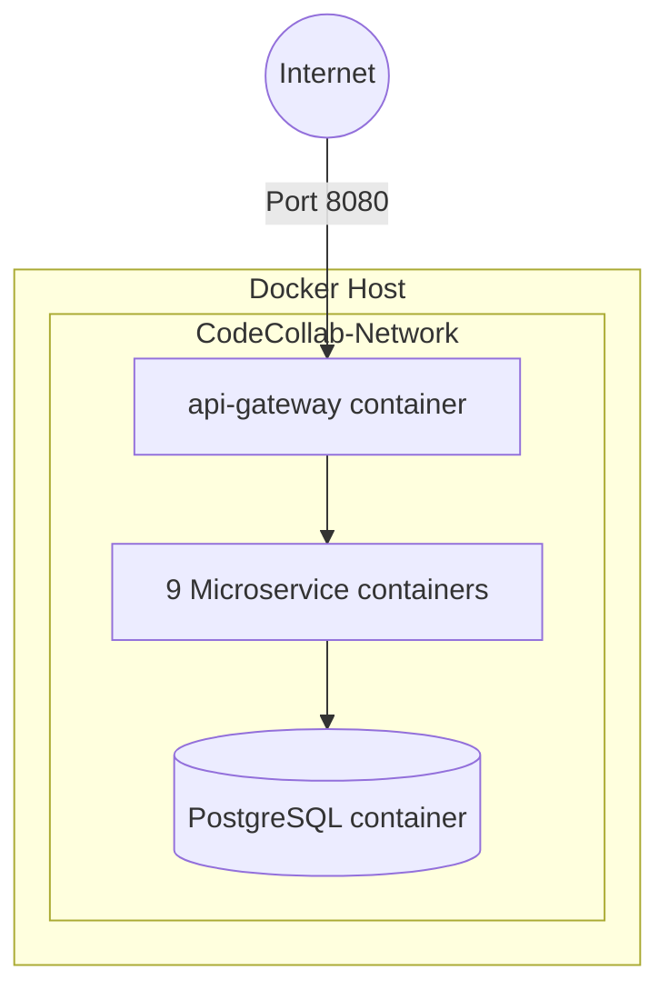
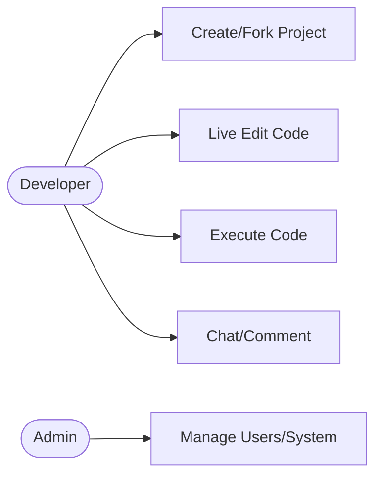

# Code Collab System Diagrams

## 1. Architecture Diagram


## 2. Flowchart / Process Diagram (Project Creation)


## 3. Data Flow Diagram (DFD - Level 0)


## 4. Entity-Relationship Diagram (ERD)


## 5. Sequence Diagram (WebSocket Collaboration)


## 6. Deployment Diagram


## 7. Use Case Diagram


## 8. Wireframes / UI Mockups (Textual)
**IDE Dashboard:**
```text
[ Navbar: Logo | Search | Profile Dropdown ]
------------------------------------------------
[ Sidebar ] | [ Main Editor Window            ]
- Files   |   1: function hello() {           
- main.js |   2:   console.log("hi");         
- utils.js|   3: }                            
          |-----------------------------------
[ Terminal]| [ Output Terminal / Chat Box    ]
```
