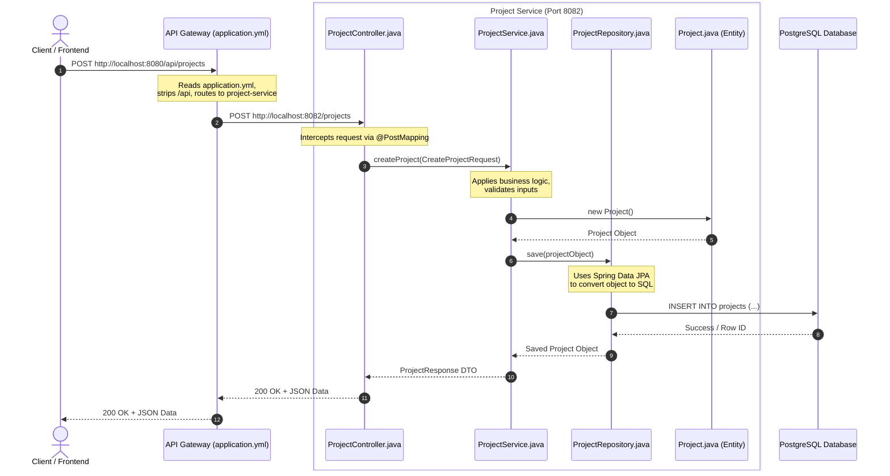
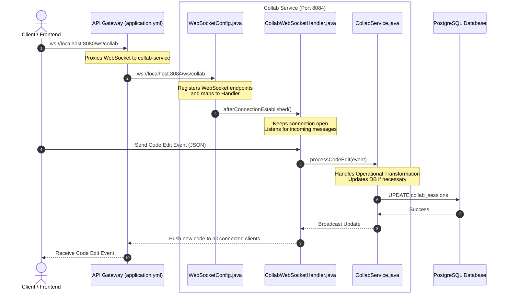

# Microservice Execution Flow

This document explains the exact step-by-step file execution flow of a request originating from the Frontend, traversing through the API Gateway, and being processed inside a specific microservice.

## 1. How the Frontend Contacts the Microservices

The frontend (e.g., React on `http://localhost:5173`) **never** contacts individual microservices directly. Instead, it sends all requests to a single entry point: the **API Gateway** running on `http://localhost:8080`.

The API Gateway uses the `application.yml` file to map incoming URL paths to specific backend microservices.
- **REST APIs:** A request to `GET /api/projects/1` is forwarded to `project-service:8082/projects/1`.
- **WebSockets:** A connection to `ws://localhost:8080/ws/collab` is proxied to `ws://collab-service:8084/ws/collab`.

---

## 2. Typical REST API Execution Flow (Example: Creating a Project)

Every microservice in this backend follows the standard **Spring Boot MVC (Model-View-Controller)** architecture. Here is the exact sequence of files invoked when the frontend requests to create a new project:

### File-by-File Breakdown:
1. **`api-gateway/src/main/resources/application.yml`**: Determines where the request goes based on the route predicate (`/api/projects/**`).
2. **`ProjectController.java`**: The entry point inside the microservice. It maps HTTP verbs (`@GetMapping`, `@PostMapping`) to Java methods and handles incoming JSON requests.
3. **`ProjectService.java`**: The brain of the microservice. It contains the core business logic (e.g., verifying user permissions, setting default project values).
4. **`Project.java`**: The Data Entity. It represents the database table structure as a Java object (annotated with `@Entity` and `@Table`).
5. **`ProjectRepository.java`**: An interface extending `JpaRepository`. It acts as the bridge to the database, executing SQL queries without needing manual SQL code.

---

## 3. Real-Time WebSocket Execution Flow (Example: Collaborative Editing)

For real-time features like simultaneous code editing or chat, a continuous connection is required rather than a single request/response.

### File-by-File Breakdown:
1. **`WebSocketConfig.java`**: Configures the WebSocket registry, defining endpoints like `/ws/collab`.
2. **`WebSocketHandler.java` (or Controller)**: Intercepts raw WebSocket messages (like typing events or code changes), manages active client sessions, and broadcasts messages back to connected users.
3. **`CollabService.java`**: Processes the incoming WebSocket events, determining how they affect the current project state.
