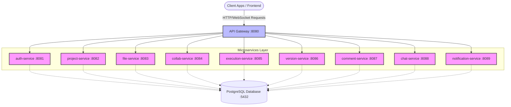
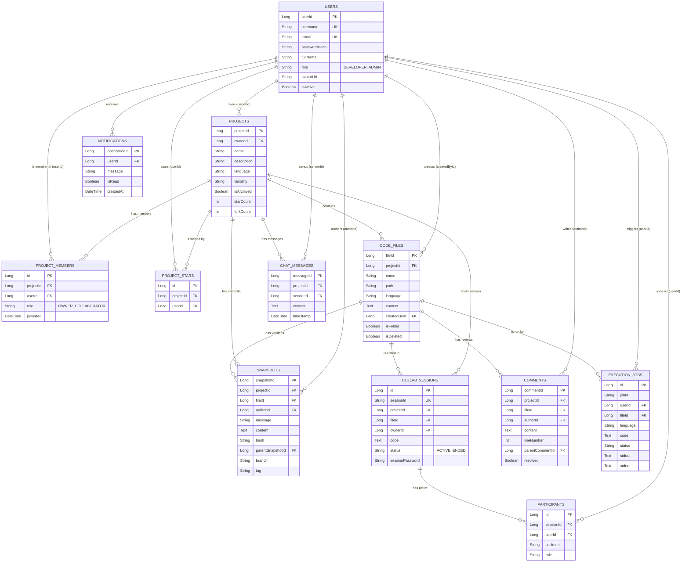

# System Architecture & ER Diagram

This document outlines the architecture and data model for the **Code Collab Backend**, a microservices-based platform designed for real-time collaborative coding.

## 1. High-Level Architecture Diagram

The system employs a microservices architecture, where a central API Gateway routes traffic from clients to the appropriate backend services. All services currently connect to a shared PostgreSQL database, operating within a Docker network (`codecollab-network`).

> [!NOTE]
> All services run in isolated Docker containers but share the same virtual network (`codecollab-network`). Service discovery and load balancing are handled internally or through the API gateway.

---

## 2. API Gateway Connection Explained

The **API Gateway** acts as the single entry point into the system for all client requests. 

### Core Responsibilities:
1. **Request Routing**: It takes incoming requests (e.g., `GET /api/projects`) and routes them to the exact downstream service (e.g., `project-service:8082`).
2. **Security & Authentication (Edge Security)**: It often intercepts requests to validate JWT tokens before forwarding them to underlying services.
3. **Cross-Origin Resource Sharing (CORS)**: The gateway handles CORS headers for frontend web applications.
4. **WebSocket Proxying**: For real-time features like chat and collaborative coding (handled by `chat-service` and `collab-service`), the gateway proxies WebSocket connections.

### Connection with Microservices:
In the `docker-compose.yml`, the `api-gateway` explicitly `depends_on` all other microservices. It connects to them via their Docker container names (e.g., `http://auth-service:8081`). Because they are all on the `codecollab-network` bridge network, the Gateway resolves these service names via Docker's internal DNS.

---

## 3. Entity-Relationship (ER) Diagram

Below is the database schema spanning across the different microservices. Note that in a strict microservices environment, these tables are logically (and sometimes physically) separated by bounded context, even if they share the same PostgreSQL instance.

---

## 4. Microservices Breakdown

1. **`auth-service`**: Handles user registration, login, JWT generation, and profile management. Stores data in the `users` table.
2. **`project-service`**: Manages the creation, metadata, visibility, and membership of projects. Handles `projects`, `project_members`, and `project_stars` tables.
3. **`file-service`**: Acts as the virtual filesystem for the project. Manages directories, files, and their initial contents in the `code_files` table.
4. **`collab-service`**: The real-time heart of the application. It utilizes WebSockets/Operational Transformation (or CRDTs) to allow multiple users to edit the same file simultaneously. Manages `collab_sessions` and `participants`.
5. **`version-service`**: Operates similarly to a simplified Git backend. It takes snapshots of code files, managing commit history, branching, and tagging in the `snapshots` table.
6. **`execution-service`**: Responsible for taking code strings, compiling them (if necessary), and executing them securely (often inside isolated sandboxes/containers). Logs output in `execution_jobs`.
7. **`comment-service`**: Handles line-specific code review comments, threads, and resolutions. Manages the `comments` table.
8. **`chat-service`**: Provides project-level or session-level real-time text chat using WebSockets. Stores history in `chat_messages`.
9. **`notification-service`**: Centralizes alerts across the system (e.g., "User X invited you to a project", "Build failed"). Stored in `notifications`.
